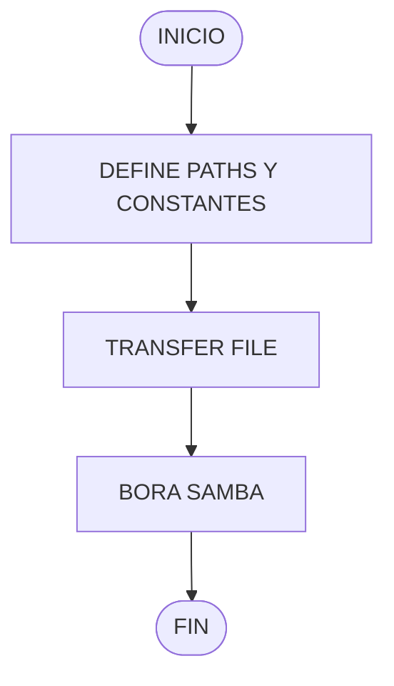
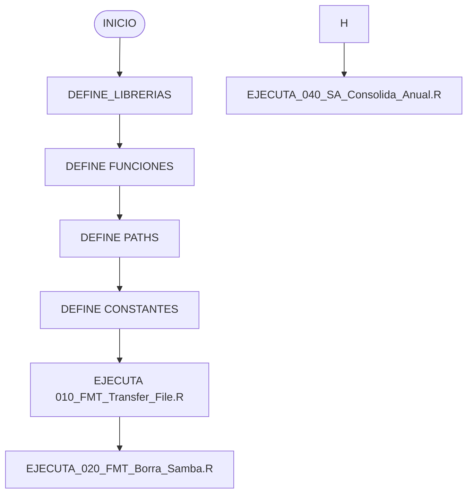

#  **000_FMT_GLOBAL**


## **INTRODUCCIÓN:**
### **Descripción General**
Proyecto utilizado para agregar herramientas que ayuden a el flujo de procesos que se llevan a cabo dentro de la empresa.

### **Objetivos**
- Organizar el flujo de procesos.

### **Alcance**
Este proyecto se centra exclusivamente dentro de los catálogos, proyectos, reportes, etc. que se encuentren en OneDrive y servidores relacionados al área.

## **INSTALACIÓN:**
### **Requisitos del Sistema**
- **Hardware:** Procesador de 2 GHz, 4 GB de RAM, 500 MB de espacio en disco.
- **Sistema Operativo:** Windows 10, macOS Catalina, Linux Ubuntu 18.04+.
- **Dependencias:** R 4.0+, Power_BI Desktop.

### **Instrucciones de Instalación:**
1. Instalar el CRAN de R
2. Instalar RStudio
3. Instalar Git
4. Clonar repositorio **(git remote origin https://github.com/...)**

***

## **USO DEL SOFTWARE:**
### **Guia del Usuario**
- Ejecución
    - Abrir el proyecto con RStudio
    - Abrir script **000_Hechos.R**
    - Ejecutar, ya que el script contiene el flujo nesesario del proyecto
    
- Desarrollo
    - Abrir el proyecto con RStudio
    - Abrir script **000_Hechos.R**
    - Definir la variable Modo en 0, que define la forma de desarrollo.
    
    
[!TIP]
Asegurar que las carpetas se encuentren en la ruta correcta, ya que se utilizan en el proceso del poyecto.
***

## **ARQUITECTURA DEL SOFTWARE:**
### **Flujo del Proyecto**



## **SCRIPTS:**
Los nombres de los Scripts comienzan por un número asigando a la funcion que realiza el script.


| Número | Función |
| :----: | :-----: | 
| 000 | Actualización de catálogos y paths|
| 010 | Transfer File |
| 020 | Borra Samba |


Dentro del código del proyecto, en la parte final de este, existe un pequeño query que funciona para limpiar el Environment del proyecto, dentro de este query esta una lista para agregar datos que se pueden reutilizar en el futuro de la ejecución

``` 
  #Lista de data frames a conservar
  vGuarda <- c(ls()) #Agregar datos que se guardan en el environment
  vMantener <- c(vMantener, vGuarda)
  vBorrar <- setdiff(ls(), vMantener)
  
  rm(list = vBorrar)
  rm(vBorrar)
```

### **000_Hechos.R**
#### **Descripción**
Script que lleva el flujo del proyecto, definiendo los dataframes, variables, constantes, funciones, conjunto de datos, etc. necesarios para los calculos que se generan mas adelante.

El proyecto tiene modo de Desarrollo o modo Despligue, modo desarrollador es para agregar cambios en el código y el modo despligue se ejecuta en el servidor:

| Modo | Descripción | ID | 
| :----: | :-----: | :----: |
| Desarrollo | Trabaja con catalogos locales que se encuentren en la memoria del equipo, por lo cual **es necesario la ruta de carpetas este definida correctamente, tal cual se encuentra el Sharepoint.** | 1 |
| Despliegue | Trabaja con los catalogos concentrados en SharePoint. | 0 |

#### **Diagrama de Flujo**



#### **Reglas**
-

### **010_FMT_Transfer_File.R**
#### **Descripción**
Este script es una herramienta diseñada para facilitar el movimiento de archivos dentro de **OneDrive** y servidores relacionados con el área. Utiliza un catálogo ubicado en la carpeta del proyecto, específicamente en el archivo **01_Tablas/Transfer_File.xlsx**, el cual debe completarse con la información necesaria para que el script funcione correctamente.

#### **Diagrama de Flujo**
```mermaid
A([INICIO]) --> B[LEE CATÁLOGO Trasnfer_File.xlsx]
B --> c[DEFINE PATHS ORIGEN Y DESTINO]
C --> D{EXISTE ARCHIVO EN RUTA DESTINO}
D --> |SÍ| E[ELIMINA ARCHIVO EXISTENTE]
D --> |NO| F[MUEVE ARCHIVO]
E --> G([FIN])
```
